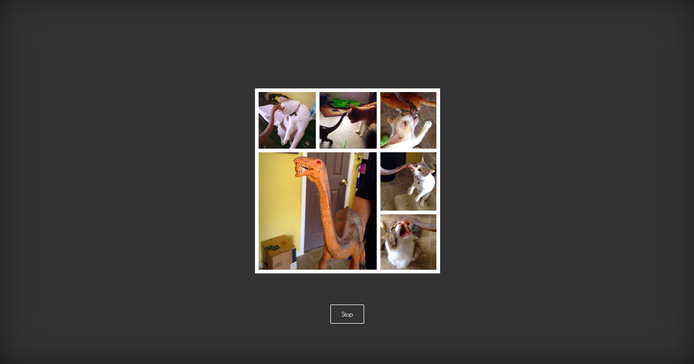

#Reddit photo slideshow

We are going to use what we've learned so far to create a basic slideshow using images taken from reddit via AJAX.

####Content Warning

Reddit sometimes contains some offensive images be careful with your search terms. If you want to ensure that you do not get NSFW (Not Safe For Work) items. You can filter it by adding "nsfw:no" to the end of the search query.

**Example:** http://www.reddit.com/search.json?q=cats nsfw:no

##Getting Started

* Fork and clone this repository
* Run `npm install` to install dependencies
  * `npm start` - start the BrowserSync server
  * `npm run lint:css` - lint CSS
  * `npm run lint:js` - lint JS

##Requirements/User Experience

####Page should load with

* Some sort of title
* A short description telling the user what to do
* A blank text field
* A Button ("start" or "go" or "search")

####When the user enters a search term and presses enter

* The form / title / description should hide
* Show a loading message (optional)
* Fetch related posts from reddit (with ajax)
* Display animation / slideshow of images (jQuery)
* Show a button to stop / reset the animation
* Repeat animation until use clicks "stop"

####When the user clicks the "stop" button

* Animation stops / images are removed
* Form / title / description are shown again
* User can enter a new search term

##Suggested proccess

It is important to break down any development project in to smaller pieces and tackle them one at a time. Here is a list of how you might want to attack this project.

* Create your form (HTML/CSS)
* Prevent default and show an alert on form submit
* Use AJAX to make a request. Show data in console
  * **IMPORTANT NOTE:** You'll need to set `crossDomain: true` in your AJAX request. Otherwise, you'll get a cross origin error. See documentation here: http://api.jquery.com/jquery.ajax/
* Create an array of image URLs (tip: use [filter](https://developer.mozilla.org/en-US/docs/Web/JavaScript/Reference/Global_Objects/Array/filter) and [map](https://developer.mozilla.org/en-US/docs/Web/JavaScript/Reference/Global_Objects/Array/map)).
* Make the form / title / description hide
* Cycle through images
    * tip: use [setInterval](https://developer.mozilla.org/en-US/docs/Web/API/WindowTimers/setInterval)
    * Maybe just set the src attribute of a single image tag for now
* Add some interesting style / animation
* Create button to stop animation (tip: use [clearInterval](https://developer.mozilla.org/en-US/docs/Web/API/WindowTimers/clearInterval)).

##Example Deliverables

---

##Bonus

* Use Additional jQuery animation plugins
  * [jQuery Animation plugins](http://plugins.jquery.com/tag/animation/)
